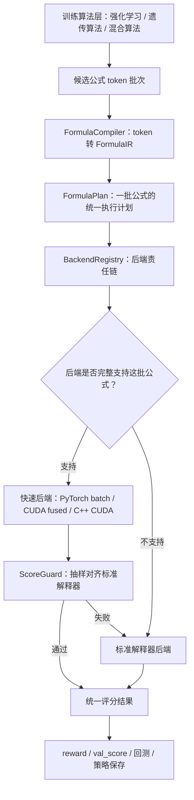
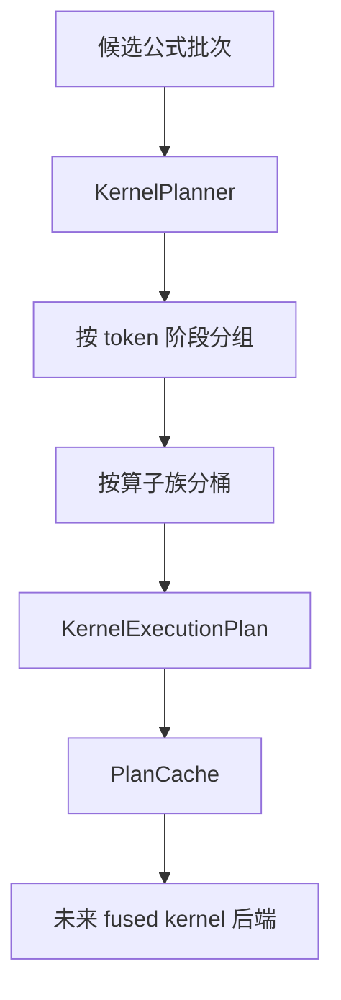

# 公式执行框架设计

目标：把“算法怎么生成公式”和“公式怎么被高速执行”拆开。强化学习、遗传算法、混合算法都只负责产生候选公式；公式执行框架负责把公式变成统一计划，再交给不同后端执行；评分器负责给出统一分数。

## 总体结构



## 各层职责

### 训练算法层

负责产生公式，不负责公式执行细节。

当前包括：

- 强化学习算法：Transformer 采样公式，通过 reward 更新模型。
- 遗传算法：后续独立模块，负责选择、交叉、变异、保留种群。
- 混合算法：暂时只保留隔离框架，不和强化学习热插拔策略强绑定。

这一层不应该知道公式最终是 CPU、PyTorch batch、CUDA 还是 C++ 执行。

### 公式语言层

负责把 token 序列解析成统一结构。

核心文件：

- `model_core/formula_ir.py`

核心对象：

- `FormulaNode`：公式树里的一个节点，可以是特征，也可以是算子。
- `FormulaIR`：单条公式的中间表示。
- `FormulaPlan`：一批公式的统一执行计划。
- `FormulaCompiler`：把 token 公式解析成 IR。

例子：

```text
token 公式：
RET, RET5, ADD

IR：
Node0 = Feature(RET)
Node1 = Feature(RET5)
Node2 = ADD(Node0, Node1)
```

### 执行后端层

负责执行公式，但不改变评分逻辑。

核心接口：

- `FormulaEvaluator.supports(ir)`：声明自己是否支持某条公式。
- `FormulaEvaluator.evaluate_plan(plan, ...)`：执行一批公式计划。

当前后端：

- `StandardFormulaEvaluator`：标准解释器，永远作为正确性基准。
- `FastBatchFormulaEvaluator`：现有 PyTorch 批量后端。

未来后端：

- `CudaFusedFormulaEvaluator`：真正的融合 kernel 后端。
- `CppCudaFormulaEvaluator`：C++/CUDA 扩展后端。
- `TorchCompileFormulaEvaluator`：如果环境支持，可以作为编译后端。

### 后端注册与选择

核心对象：

- `BackendRegistry`

后端按“最快、最具体”到“最稳、最通用”注册：

```text
cuda_fused -> torch_batch -> standard
```

如果快速后端不能完整支持当前公式批次，路由器会回退到标准解释器。

### 校验层

核心对象：

- `ScoreGuard`

快速后端不能直接无条件相信。它需要定期抽样和标准解释器比较：

- 因子值差异
- reward 差异
- val_score 差异
- status 差异

只要超过容忍阈值，就自动回退标准解释器。

## 为什么这个方案比逐个算子补丁更稳

逐个算子补丁的问题是：每增加一个优化点，就容易改到训练主流程，最后形成大量组合分支。

当前方案的原则是：

```text
新增优化 = 新增后端 或 新增编译阶段
```

训练算法不变，评分合同不变，标准解释器不变。

## 当前完成状态

已完成：

- token 公式解析为 IR。
- 一批公式编译为 FormulaPlan。
- 后端支持度统计。
- 后端注册表。
- 评估路由器按 FormulaPlan 执行。
- ScoreGuard 仍然保留。

未完成：

- 真正 CUDA fused 后端。
- 公式片段编译缓存。
- 页面展示后端覆盖率。
- 针对真实高频算子的底层 kernel。

## 后续实现顺序

1. 先用最近 checkpoint 统计真实高频算子。
2. 选择覆盖率最高的一组算子做 fused 后端。
3. 每个 fused 后端必须先通过 ScoreGuard。
4. 页面显示后端名称、覆盖率、校验差异、回退次数。
5. 只有结果完全对齐后，才允许作为训练默认路径。

## Kernel 优化层

Kernel 优化不应该直接侵入训练主循环。它应该先做成独立计划层：



核心文件：

- `model_core/kernel_planner.py`

核心对象：

- `KernelPlanner`：把一批公式转成 kernel 分桶计划。
- `KernelBucket`：同一执行阶段、同一算子、同一参数形态的一组公式。
- `KernelExecutionPlan`：一批公式的 launch 优化计划。
- `KernelPlanCache`：缓存重复公式批次，避免每步重复解析。

这个计划层只分析，不执行，不改分数。它的作用是回答：

- 哪些算子能合并成一个 kernel。
- 哪些算子频率最高，最值得写底层 fused kernel。
- 理论上能减少多少 kernel launch。
- 哪些公式或算子还不支持，需要回退。

当前真实 checkpoint 初步观察：

```text
最近 4 个 D1 checkpoint：
naive launches = 995
bucketed launches = 504
理论 launch 减少约 49.3%
```

这说明“按算子分桶 + 合并 kernel”的方向确实有空间。但这只是调度层证据，不代表已经真实提速；真实提速必须等 fused kernel 后端实现后，再和标准解释器做数值对齐与计时对比。
