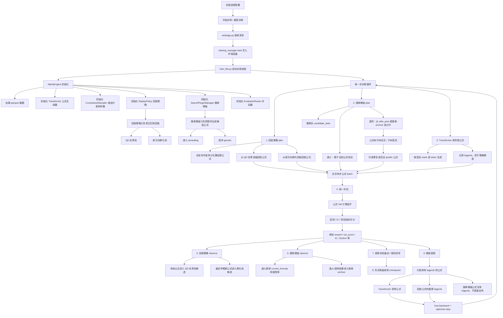

# AlphaMaster Training Algorithm Blueprint

更新时间：2026-08-02

这份蓝图记录当前强化学习训练算法、回放策略、搜索增强插件、遗传算法接入点，以及下一步要升级的语义行为 QD Archive 设计。它是项目内的参考文档，用来避免后续改动时把“回放”“搜索增强”“遗传”“冠军保存”混在一起。

## 1. 当前版本边界

当前主训练算法仍然是强化学习 RL。模型负责按语法约束生成公式，评估器负责打分，回放策略负责记忆和抽样，搜索增强插件负责额外产生候选公式。

当前已经撤掉的旧设计：

- `elite_genetic` 不再是精英回放策略。
- 遗传算法不再直接作为回放公式参与策略梯度。
- 遗传算法不再直接拉动 Transformer 生成器。

当前保留的新设计：

- 遗传算法属于搜索增强插件 `genetic`。
- 遗传算法可以从 QD 优秀池借父代。
- 遗传算法只生成候选公式。
- 候选公式必须经过统一评估，分数好才自然进入 QD 优秀池、孵化池或冠军保存链路。

## 2. 当前完整流程



## 3. 当前模块职责

### 3.1 Transformer 公式生成器

位置：`model_core/engine.py`

职责：

- 根据当前 token 前缀生成下一个 token 概率。
- 通过 `ConstrainedSampler` 的语法 mask 保证公式合法。
- 生成的新公式带有 logprob，因此可以用于策略梯度。

### 3.2 回放策略 ReplayPolicy

位置：`model_core/replay_policies.py`

当前可选模块：

- `qd`：QD 优秀池。
- `incubation`：新方向孵化池。

职责：

- 决定本步回放多少历史公式。
- 从 QD 优秀池和孵化池抽样。
- 对评估后的公式执行 `observe`，更新池子。

当前 QD 分桶还是简化结构桶，使用 `formula_bucket_key`：

- 起始 token。
- 特征数量。
- 时间序列算子数量。
- 算术算子数量。
- 归一化算子数量。
- 非线性算子数量。

这还不是完整的语义行为 QD Archive。

### 3.3 搜索增强 SearchPluginManager

位置：`model_core/search_plugins.py`

当前可选模块：

- `annealing`：退火搜索。
- `genetic`：遗传搜索。

职责：

- 在每步剩余候选槽位里，额外产生一批候选公式。
- 搜索增强公式进入统一评估。
- 搜索增强公式不直接进入策略梯度，因为它们不是当前策略分布采样出来的，没有可靠 logprob。

### 3.4 新版遗传 genetic

位置：`model_core/elite_genetic.py`

当前逻辑：

1. 从 QD 优秀池优先取父代。
2. 如果 QD 优秀池不足，再用搜索 archive。
3. 将 postfix 公式解析成公式树。
4. 用锦标赛选择父代。
5. 执行子树交叉。
6. 按概率执行子树变异。
7. 用 `ConstrainedSampler` 修复成合法公式。
8. 返回候选公式，交给统一评估。

关键边界：

- 遗传只造候选。
- 遗传不直接更新神经网络。
- 遗传不直接进入精英回放梯度。
- 遗传产物如果评分好，会通过统一 `observe` 自然进入 QD 或孵化。

## 4. “造候选”的准确含义

造候选不是保存冠军，也不是更新模型，而是产生“值得拿去评估的新公式”。

例子：

```text
父代 A = RVOL -> TS_STD_20 -> SIGN -> TANH_SQUASH
父代 B = ATR -> TREND_STRENGTH_50 -> DELTA -> IF_GT
```

遗传模块会把 A、B 解析成公式树，然后：

```text
从 A 取一个子树
从 B 取一个子树
交叉拼接
随机变异一段
再修复成合法公式
```

得到候选 C：

```text
候选 C = RVOL -> TREND_STRENGTH_50 -> DELTA -> SIGN -> IF_GT
```

候选 C 随后和 Transformer 新公式、QD 回放公式、孵化公式一起进入同一套评估流程。只有分数、稳定性和池子规则通过后，它才会被保留。

## 5. 当前版本的不足

当前 QD Archive 还偏浅，主要按公式结构分桶。它可以缓解“只记一种公式形态”，但还不足以表达以下维度：

- 起始特征类型：量、价、波动、趋势、资金流。
- 公式复杂度。
- 多空暴露强弱。
- IC 稳定性区间。
- train/val 差距。
- 交易频率或换手区间。

因此，当前遗传虽然位置正确，但父代多样性仍然受限于现有结构桶。

## 6. 下一版设计：语义行为 QD Archive

目标：

```text
高分不是唯一保留标准。
系统要保留不同类型、不同复杂度、不同暴露、不同稳定性的优秀公式。
```

推荐 QD key：

```text
(
  起始特征类型,
  时间序列算子数量档位,
  归一化算子数量档位,
  非线性算子数量档位,
  公式复杂度档位,
  多空暴露强弱档位,
  IC 稳定性档位
)
```

### 6.1 起始特征类型

从第一个特征 token 或主要特征 token 映射：

- 量能。
- 价格。
- 波动。
- 趋势。
- 资金流。
- 其他。

### 6.2 时间序列算子数量

档位：

- `0`
- `1`
- `2`
- `3+`

### 6.3 归一化算子数量

档位：

- `0`
- `1`
- `2+`

### 6.4 非线性算子数量

档位：

- `0`
- `1`
- `2+`

### 6.5 公式复杂度

由 token 数、算子数、嵌套深度综合判断：

- 简单。
- 中等。
- 复杂。

### 6.6 多空暴露强弱

从评估过程中产生的信号或仓位统计里提取：

- 偏空。
- 中性。
- 偏多。
- 双边强。

参考指标：

- 平均仓位。
- 正信号比例。
- 负信号比例。
- 平均绝对暴露。

### 6.7 IC 稳定性

从多个验证切片中提取：

- 不稳。
- 一般。
- 稳定。

参考指标：

- IC 均值。
- IC 标准差。
- IC 符号一致性。
- 验证切片通过率。

## 7. 升级后的存储结构

当前 ReplayEntry：

```text
(score, counter, formula, birth_step)
```

建议升级为兼容结构：

```text
{
  "score": 原始 val_score,
  "archive_score": 用于池内排序的综合分,
  "counter": 插入序号,
  "formula": token 列表,
  "birth_step": 出生步数,
  "qd_key": 语义行为格子 key,
  "descriptor": 结构和行为描述
}
```

兼容原则：

- 旧 checkpoint 仍可读取。
- 旧 tuple entry 读取时现场转换成新 dict。
- 最终冠军分仍使用原始评估分，不使用 `archive_score` 替代。

## 8. 升级后的抽样策略

### 8.1 回放抽样

从“先抽公式”改为“先抽格子，再抽公式”：

```text
70% 从高质量格子抽
20% 从低访问格子抽
10% 从新格子抽
```

这样可以继续利用好公式，但不会让单一冠军方向长期控制训练。

### 8.2 遗传父代抽样

从“从 elite_pool 里挑两个高分父代”升级为“跨格子挑父代”：

```text
50% 高分格子
30% 稀有格子
20% 新近格子
```

两个父代尽量来自不同 QD key，提升交叉后的新方向概率。

## 9. 评分边界

必须保持不变：

- 不改公式真实评估分。
- 不改回测逻辑。
- 不改冠军保存判断的原始分数体系。
- 不让搜索增强公式直接参与策略梯度。

可以新增：

- `archive_score`：只用于 QD 池内排序、抽样权重、父代选择。
- `descriptor`：只用于分类、展示、分析。
- `qd_key`：只用于分桶。

推荐 `archive_score`：

```text
archive_score =
  val_score
  - 过拟合惩罚
  + IC 稳定性奖励
  - 复杂度轻微惩罚
  - 过强单边暴露惩罚
```

## 10. 最小侵入实施顺序

1. 新增 `FormulaBehaviorDescriptor`，只负责从公式和评估结果提取维度。
2. 新增 `QDArchiveEntry`，兼容旧 tuple。
3. 替换 `formula_bucket_key` 为“结构 + 行为” key，但保留旧结构 key 作为 fallback。
4. QD 优秀池改为按 `qd_key` 每格 Top-K。
5. 孵化池也使用同一套 descriptor，但保留年龄窗口。
6. 遗传父代选择改为跨格子选择。
7. 训练历史增加可观测指标：
   - `qd_cells`
   - `qd_feature_types`
   - `qd_exposure_bins`
   - `qd_ic_stability_bins`
   - `genetic_parent_cells`
8. 页面增加 QD Archive 摘要，但不要影响训练主流程。

## 11. 当前代码参考位置

- 训练主循环：`model_core/engine.py`
- 回放策略：`model_core/replay_policies.py`
- 搜索增强：`model_core/search_plugins.py`
- 树结构遗传：`model_core/elite_genetic.py`
- 配置项：`model_core/config.py`
- 前端训练控制：`web/static/app.js`
- 后端训练接口：`web/app.py`
- 训练进程管理：`web/training_manager.py`

